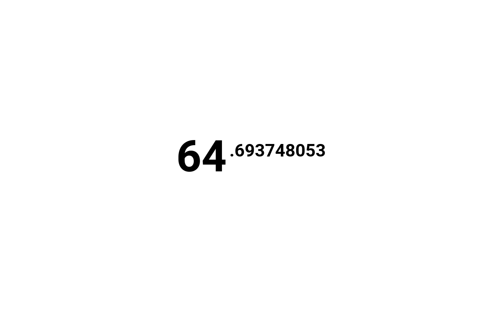

Death Clock
===========

A rewrite of [True Motivation](https://github.com/maccman/motivation) by [Tejas Manohar](https://github.com/tejasmanohar).
Death Clock is hand-optimized for startup time; the largest contribution to the page's load time is waiting for Chrome to fetch the JavaScript. On Linux with DRI3-enabled X11 on an intel Haswell platform, this new tab page will render the first frame with your remaining years and avoid a white flash roughly 90% of the time.

